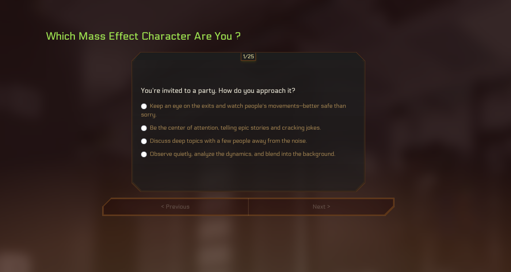

# Mass Effect Test

I put together a personality test that links you to a Mass Effect character while also figuring out who you’d most likely romance in the series.

You can see it here: [thomasdargent.com](https://thomasdargent.com/mass_effect_test/)

The results are subjective, but I’ve tried to stay true to each character’s personality and preferences. I think I got close enough on most of them. For romance, I wanted it so that you get both what you ask for, and who the character would be drawn to. That means I had to decide what would some character want and... that's entirely my interpretation. For example, I set up Wrex with Eve-like character, which can be surprising when a calm person get a huge krogan as a partner, and Paragon Shepard to gravitate toward people in need of stability (white knight syndrome and all that). I tweaked everything a lot so each character get his perfect match. But hey, feel free to argue—I love a good debate!

The questions are made to cover a wide range of personalities and priorities, from how you handle danger to what you’d do on a free day. Some answers are similar, but I accounted for that. In the same manner, characters will prioritize certains traits to decide if they likes you.

You can see which answers I set for each character by clicking on "Consult their psychological profile", on the bottom, to see how I matched each character to specific answers. If you think I got something wrong, I’d love to hear your take (nicely, please)!

Test yourself, and let me know which character and romance you get! And don't take it the wrong way if you're Udina !
